# LLM Chat Platform

Reference architecture for an enterprise-ready LLM Chat backend, focused on transactional guarantees, observability, traceability, and cost-aware operation.

This project models how AI-powered workloads should be integrated and operated in production-like environments with:

* Provider-agnostic orchestration
* Fully transactional write-path design
* Deterministic trace reconstruction
* Structured JSON logging
* Offline cost analytics
* Explicit operational boundaries

> This project intentionally prioritizes architectural clarity, invariants, and operational correctness over feature velocity.

---

## Architecture Diagram



---

## Core Principles

### 1. Transactional Integrity First

`/chat` is the **single authoritative write-path**.

Each request uses a single DB transaction in non-stream mode.
When `stream=true`, tokens are streamed via SSE first and persistence happens in a single DB transaction after the provider completes.

1. Persist user message
2. Invoke provider via `ChatService`
3. Persist assistant message
4. Persist `UsageEvent`

On failure:

* Business writes are rolled back
* Error telemetry is emitted best-effort (without foreign keys)

No partial persistence is allowed.

---

### 2. Provider-Agnostic Architecture

Providers implement an async-first contract:

- `ProviderPort.generate(input: ProviderInput) -> ProviderResult`
- `ProviderPort.stream(input: ProviderInput) -> ProviderStreamSession`

`ChatService` orchestrates execution but:

* Has no DB access
* Has no HTTP semantics
* Has no transaction control

This preserves strict separation between domain orchestration and persistence.

#### Provider Resilience Boundary

The provider layer acts as a hardened isolation boundary between external LLM APIs and core domain logic.

Features:

* Controlled retry with exponential backoff
* Retry only for transient failures (429, 5xx, timeout)
* Optional single-hop fallback between configured providers
* No retry for auth or client errors
* Full HTTP + transport error normalization into `ProviderError`
* Structured provider logging events:
  - provider.request
  - provider.retry
  - provider.response
  - provider.error
  - provider.total

Guarantees:

* No API keys leaked
* No raw provider payloads propagated
* No message content logged
* No changes to `/chat` contract
* Fallback remains provider-local and invisible to `ChatService`
* Streaming fallback is allowed only before the first emitted token
* No provider fallback occurs after partial stream emission

---

### 3. Runtime vs Operations Separation

* No DB checks at API startup
* Migrations are never auto-run
* Alembic is executed explicitly
* Docker healthchecks handle readiness

The API process lifecycle remains deterministic.

---

## Observability & Traceability

### Structured JSON Logging

One JSON log line is emitted per HTTP request:

```json
{"request_id":"...","path":"/health","method":"GET","status":200,"latency_ms":1,"app_env":"development"}
```

Characteristics:

* Correlated via `request_id`
* No request/response bodies logged
* Logs to stdout (cloud-friendly)
* No vendor lock-in
* No impact on `/chat` semantics

---

### Structured Provider Logging

In addition to HTTP-level logs, the provider adapter emits structured JSON events for operational diagnostics:

Events:

* provider.request
* provider.retry
* provider.response
* provider.error
* provider.total
* provider.fallback
* provider.final

These logs include safe metadata only:

- request_id
- provider
- model
- attempt
- max_attempts
- status_code
- latency_ms

`provider.request` through `provider.total` are adapter-local lifecycle events. `ResilientProvider` adds
cross-provider operational summaries via `provider.fallback` and `provider.final`.

Additional fields available in cross-provider events include:

- attempts_used
- failure_kind
- final_provider
- fallback_used

`provider.total` remains adapter-local.
`provider.final` is the cross-provider summary and may include `fallback_from`, `fallback_to`, and
`first_token_emitted` for streaming when relevant.

No user message content or secrets are logged.

This enables production-grade observability without compromising data safety.

---

### Deterministic Trace Reconstruction

Every `/chat` execution can be reconstructed from a `request_id`:

* Input message
* Output message
* Latency
* Provider metadata
* Status

This is implemented as a **read-only analysis layer**, without modifying the write-path or schema.

---

### Offline Cost Analytics

The platform includes:

* Provider-agnostic cost estimation (`estimate_cost`)
* Static per-provider token rates (configurable)
* Read-only export pipeline over `usage_events`
* Offline aggregation (cost by provider, status, day)

Characteristics:

* No external pricing calls
* No billing coupling
* No schema changes
* Fully reproducible via scripts

This enables deterministic cost reasoning from recorded token usage.

---

## Data Model (Operational View)

### Conversation

Logical chat session container.

### Message

Ordered by `(conversation_id, created_at)`.

### UsageEvent

Foundation for:

* Telemetry
* Cost estimation
* Observability
* Failure audit

Nullable foreign keys allow error telemetry without breaking atomicity.

---

## Tech Stack

* FastAPI (async API)
* PostgreSQL
* SQLAlchemy 2.0 (async)
* Alembic
* Docker / Docker Compose
* Redis (best-effort response cache for non-streaming `/chat` requests)

---

## Repository Structure

```
app/
  main.py
  api/
  core/
  infra/
  models/
  services/
  scripts/

alembic/
docs/
experiments/
```

---

## Running the Platform

```bash
git clone <repo>
cd llm-chat-platform
cp .env.example .env
docker compose up -d
```

Health check:

```
GET /health
```
### Local streaming demo UI (deprecated)

**Deprecated as of ORQ-19.6** — superseded by the `llm-chat-platform-web` frontend (React + Vite, see that repo's README). `GET /ui` still works and logs a `deprecated_endpoint_used` warning on each request; removal is tracked for ORQ-20.

After starting the API container, open:

- `http://localhost:8001/ui` (if port publishing works on your host)

If not, use the API container IP:

```bash
docker inspect -f '{{range .NetworkSettings.Networks}}{{.IPAddress}}{{end}}' llm-chat-platform-dev-api-1
```
Then open: http://<IP>:8000/ui

### CORS (frontend consumption, ORQ-19.6)

`CORSMiddleware` is enabled for browser-based frontends (e.g. `llm-chat-platform-web`, dev server on `:5173`).

- **`CORS_ALLOW_ORIGINS`** — comma-separated list of allowed origins. Default `http://localhost:5173` when unset or blank; there is no "block all origins" mode via this variable.
- Fixed (not configurable via env): `allow_credentials=False` (the tenant travels via the `X-Tenant-ID` header, not cookies), `allow_methods=["GET", "POST", "OPTIONS"]`, `allow_headers=["Content-Type", "X-Tenant-ID"]` (no `Authorization` — real auth is out of scope, see ORQ-19 non-goals).
- **Middleware order matters:** `CORSMiddleware` is registered *after* `TenantMiddleware` in `app/main.py` (`add_middleware()` is LIFO, so the last one registered runs outermost). This makes `CORSMiddleware` the outermost layer: `OPTIONS` preflights are answered directly and never reach `TenantMiddleware`, while actual requests — including SSE streaming — still pass through `TenantMiddleware` first, which keeps the tenant `ContextVar` set for the whole streamed response. This order reuses the LIFO learning documented for ORQ-18 (see ADR-003); no new ADR was needed for ORQ-19.6.

---

## Conversation Inspection Endpoints

The platform exposes read-only endpoints to inspect persisted conversations:

- `GET /conversations?limit=20&offset=0`
  - Returns conversation metadata plus `message_count` (no message content).
- `GET /conversations/{conversation_id}`
  - Returns conversation metadata plus ordered messages (`created_at ASC`).

Constraints:

- No write operations
- `/chat` remains the single authoritative write-path
- No database schema changes

---

## External Read Capabilities Demo

Two read-only endpoints are available for operator exploration and integration:

- **Web Read:** `GET /web-read?url=<url>` — Fetch and parse web page content
- **Notion Read:** `GET /notion-read/page?page_id=<page_id>` — Fetch Notion page metadata

**Try the demo:**

```bash
# Start Jupyter notebook
jupyter notebook demo_read_capabilities.ipynb
```

Then open the notebook and execute cells to:
- Explore both endpoints interactively
- See request/response shapes
- Test error handling
- Verify endpoint health

**Documentation:**

- Endpoint guide and configuration: `docs/external_read_capabilities.md`
- Troubleshooting common errors: `docs/troubleshooting_external_read.md`
- Error decision table and runbook: `docs/error_decision_table.md`

---

## Controlled Notion Read via MCP (MVP)

Optional read-only capability for accessing Notion page metadata via the Model Context Protocol (MCP).

**Endpoint:** `GET /notion-read/page?page_id=<id>`

**Capabilities (MVP):**

* Read Notion page metadata only (page_id, title, url, created_time, last_edited_time)
* Allowlist enforcement: only configured page IDs are readable
* ID normalization: dashes removed for consistent comparison
* Response sanitization: no page text, blocks, or internal Notion fields

**Setup (requires external notion-mcp-read subprocess):**

```bash
# Clone with submodule
git clone --recursive <repo>

# Configure in .env
NOTION_READ_ENABLED=true
NOTION_MCP_ENABLED=true
NOTION_API_TOKEN=<notion_integration_token>
NOTION_ROOT_PAGE_ID=<root_page_id>
NOTION_ALLOWED_PAGE_IDS=<comma-separated-ids>
NOTION_MCP_SERVER_COMMAND=node
NOTION_MCP_SERVER_ARGS=["/notion-mcp-server/dist/server.js"]
NOTION_MCP_SERVER_CWD=/notion-mcp-server
NOTION_MCP_TIMEOUT_S=10

# Start services
docker compose up -d
```

When running the API in Docker, the image includes Node.js and mounts the local `notion-mcp-read` checkout at `/notion-mcp-server` so the subprocess can be spawned inside the API container.

**HTTP Status Codes:**

* 200: Success (metadata returned)
* 422: Missing or invalid query params
* 403: Page ID not in allowlist
* 502: MCP protocol or upstream Notion API error
* 504: MCP request timeout
* 503: MCP subprocess unavailable
* 500: Unexpected error

**Design Principles:**

* Separate read-only endpoint (never modifies `/chat` or persistence)
* Process-level singleton MCP client (initialized at app startup via `app.lifespan()`)
* Hardcoded tool allowlist (notion_get_page only, no dynamic discovery)
* Error separation by layer (client/service/route for observability)
* Graceful degradation: endpoint unavailable does not affect `/readyz` or `/chat`

**Deferred (Phase 2):**

* Page text extraction (requires block reading)
* Database queries
* Pagination
* Readiness includes MCP health check

---

## Controlled Notion Write MVP

Write-only capability for allowlisted Notion write operations via MCP.

**Endpoints:**

* `POST /notion-write/page` — Create or update Notion page content
* `POST /notion-write/row` — Add or update row in a Notion database

**Design Principles:**

* Allowlist-based access control (configured via environment)
* Static validation of write patterns before execution
* Best-effort audit logging of write operations
* Separate endpoints remain isolated from `/chat` and core persistence
* `/chat` remains the single authoritative write-path
* All write operations follow static safety analysis

---

## Provider Configuration

Provider selection:

* `PROVIDER=stub|openai|bedrock`
* `PRIMARY_PROVIDER=stub|openai|bedrock` (overrides `PROVIDER` / `provider`)
* `FALLBACK_PROVIDER=stub|openai|bedrock` (overrides `fallback_provider`)

Stub provider knobs:

* `STUB_PROVIDER_MODE=ok|error`
* `STUB_SIMULATED_LATENCY_MS=<int>`

OpenAI provider knobs:

* `OPENAI_API_KEY` (required when `PROVIDER=openai`)
* `OPENAI_MODEL`
* `PROVIDER_TIMEOUT_S`
* `OPENAI_MAX_ATTEMPTS`
* `OPENAI_BACKOFF_BASE_MS`
* `OPENAI_BACKOFF_MAX_MS`

Bedrock provider knobs:

* `BEDROCK_REGION` (required when `PROVIDER=bedrock`)
* `BEDROCK_MODEL` (required when `PROVIDER=bedrock`)
* `BEDROCK_PROMPT_VERSION`
* `BEDROCK_MAX_ATTEMPTS`
* `BEDROCK_BACKOFF_BASE_MS`
* `BEDROCK_BACKOFF_MAX_MS`
* `AWS_ACCESS_KEY_ID` / `AWS_SECRET_ACCESS_KEY` / `AWS_SESSION_TOKEN` (optional; standard AWS credential resolution also applies)

Provider configuration is centralized in `app/core/settings.py`.
Primary/fallback precedence is handled in settings validation and consumed by the provider factory.

### Tenant Selection

Pass the `X-Tenant-ID: <tenant>` request header to scope the request to a specific tenant. Omitting the header (or sending an invalid value) silently falls back to `"default"`. JWT-based extraction (`tenant_id` claim in a Bearer token) is also supported as a second priority.

### Routing Policy

The platform includes a config-gated routing seam with multiple modes:

* `static` (default): All requests use the primary provider
* `heuristic`: Signal-based model selection based on provider-agnostic request signals
* Shadow divergence logging: Best-effort logging of routing signal divergence for observability

**Note:** ML-based routing (logistic regression for cheap-vs-smart model selection) is deferred. The current runtime uses only the heuristic routing seam with `static` as the default policy.

## Migrations

```bash
docker compose exec -w /app/app api alembic current
docker compose exec -w /app/app api alembic upgrade head
```

Migrations are never executed automatically.

---

## Testing

Canonical green command:

```bash
docker compose -f docker-compose.dev.yml run --rm -e PROVIDER=stub api python -m pytest -q
```

Minimal CI baseline:

* GitHub Actions workflow: `.github/workflows/ci.yml`
* Narrowed deterministic pytest baseline:

```bash
python -m pytest -q \
  tests/core \
  tests/api/test_health_readyz.py \
  tests/api/test_request_ids.py \
  tests/api/test_request_size_limit.py \
  tests/api/test_structured_logging.py
```

* Default Docker build validation:

```bash
docker build -t llm-chat-platform:ci .
```

Current coverage includes:

* `/chat` non-stream regression
* Streaming SSE smoke test (`token`, `done`, `error`)
* Non-streaming `/chat` Redis cache hit, miss, bypass, and failure behavior
* Read-only conversation inspection endpoints
* Health and readiness endpoints
* Request ID propagation
* Request size limit enforcement
* Structured logging behavior
* Telemetry best-effort guarantees
* Cost estimation logic

---

## Architectural Guarantees

* `/chat` remains the only write-path
* One transaction per request
* Provider failures never corrupt business data
* Observability is non-invasive
* No cost logic is coupled to provider execution
* No schema drift through analytics layers

---

## Non-Goals

This project intentionally does not:

* Provide a frontend application or build pipeline in this repo
  * The frontend lives in the separate `llm-chat-platform-web` repo (ORQ-19)
  * `GET /ui`, the old single-file demo UI, is deprecated as of ORQ-19.6 (still functional, removal tracked for ORQ-20)
* Optimize model quality
* Provide frontend components
* Act as a SaaS product
* Implement billing

It is a correctness-first backend reference system.

---

## Completed Work & Strategic Roadmap

### External Read Capabilities (Completed)

✅ **Consolidated via ORQ-14 (Closure: 2026-05-08)**

- Web Read (`GET /web-read`): Operator-ready read-only capability for fetching web page content
- Notion Read (`GET /notion-read/page`): Operator-ready read-only capability for fetching Notion page metadata via MCP
- Notion MCP Runtime: Evidence of subprocess initialization and Notion API access (ORQ-13, validated 2026-05-08)
- Documentation: Unified endpoint guide, troubleshooting runbook, error decision table, executable Jupyter demo

**Key Facts:**
- Both endpoints remain completely separate from `/chat`
- `/chat` remains the only authoritative write-path
- Zero changes to ChatService, ProviderPort, providers, persistence, streaming, or routing
- All invariants preserved; zero regression

### Closed ORQs — Governance Phase (V1.x)

✅ **ORQ-15 — Notion Write Safety Contract:** Static validation of potential write patterns; safety analysis before execution; no live writes.
✅ **ORQ-16 — Controlled Notion Write MVP:** Live `POST /notion-write/page` + `POST /notion-write/row` endpoints; allowlist-gated, best-effort audit logging.
✅ **ORQ-16.1 — Notion Write Validator Fix:** Status type validation blocker (TEST 4) fixed in `NotionWriteValidator`; unblocked ORQ-16 closure.
✅ **ORQ-17 — Phase 0 Closure:** Final baseline audit, AGENTS.md governance invariants, tag `v1.1-stable`.

### Multitenancy Foundation (ORQ-18, Closed 2026-06-30)

`tenant_id` is now a first-class dimension across the entire write path:

- **Data models:** `tenant_id VARCHAR(64) NOT NULL DEFAULT 'default'` on `conversations` and `messages`; composite index `(tenant_id, created_at)`.
- **Request context:** `TenantMiddleware` (pure ASGI — *not* `BaseHTTPMiddleware`, which resets ContextVars before SSE body is consumed). Extraction priority: `X-Tenant-ID` header → JWT Bearer claim `tenant_id` → fallback `"default"`. At the time of this ORQ it was the outermost middleware layer; as of ORQ-19.6, `CORSMiddleware` is now outermost (see below) — `TenantMiddleware` is unaffected otherwise.
- **Cache isolation:** Redis key format is `chat:response:{tenant_id}:{sha256}`; fingerprint covers the full message history (not just the last message).
- **Telemetry:** `TenantContextFilter` on the root log handler injects `tenant_id` into every `provider.*`, `chat.*`, and `cache.*` log record without touching those modules.
- **Cross-tenant enforcement:** App-layer guard — `conv.tenant_id != tenant_id → 404` in both streaming and non-streaming paths.
- **Deferred:** Full RLS enforcement and corpus scoping (ORQ-21). See [ADR-003](docs/adr/003-multitenancy-transversal-foundation.md).

### Frontend Tenant-Aware Layer (ORQ-19, Closed 2026-07-03)

Minimal chat frontend delivered in the separate [`llm-chat-platform-web`](../llm-chat-platform-web) repo (React + Vite + TypeScript), consuming this backend's existing `/chat` and `/conversations` contracts unmodified:

- Tenant-aware chat with token-by-token streaming, sanitized markdown rendering, cancellation, and distinct handling for SSE-level errors, pre-stream HTTP errors, and network/CORS failures.
- Tenant selector (persisted in `localStorage`) that clears in-memory conversation state and reloads history on switch — verified cross-tenant isolation manually with two tenants in two browser tabs sharing the same profile.
- Conversation history sidebar (`GET /conversations`) with load/continue an existing conversation and "New conversation".
- Backend-side change (ORQ-19.6, this repo): `CORSMiddleware` added — see [CORS section](#cors-frontend-consumption-orq-196) above — and `GET /ui` marked deprecated (see [Local streaming demo UI](#local-streaming-demo-ui-deprecated)).
- Verified end-to-end in a real (headless) browser against this backend, not just unit tests. `llm-chat-platform-web` ships 66 frontend tests; this repo gained 13 backend tests for CORS/tenant-order and settings parsing (265 total).
- Deferred: real auth/JWT verification, deploy (ORQ-20), the routing/classifier side panel from the design mockup (ORQ-22/23).

**Later (Sequenced)**
- Deploy pipeline (ORQ-20)
- Internal Docs Retrieval / RAG Baseline with per-tenant corpus scoping (ORQ-21)
- Routing/classifier panel (ORQ-22/23)

### Explicitly Not Implemented

- ML-based routing (logistic regression for cheap-vs-smart model selection; deferred for later implementation)
- `/chat` tool integration (read endpoints remain separate)
- RAG / embeddings / vector search
- Generic MCP tools runtime (read/write endpoints remain specific)
- Browser automation
- Real-time collaboration

---

## Documentation

* `docs/lld_llm_chat_platform_live_doc.md` — live low-level design
* `docs/lld_apendix.md` — deep technical appendices & reproducible evidence

## Architecture Decisions

Non-trivial architecture decisions are recorded as ADRs in `docs/adr/`:

| ADR | Title | Status |
|-----|-------|--------|
| [001](docs/adr/001-capabilities-first-over-execution-orchestrator.md) | Capabilities-first over execution-orchestrator | Accepted |
| [002](docs/adr/002-orq17-phase0-closure-resequencing.md) | ORQ-17 Phase 0 closure resequencing | Accepted |
| [003](docs/adr/003-multitenancy-transversal-foundation.md) | Multitenancy transversal foundation | Accepted |

See `docs/adr/README.md` for the full ADR workflow and template.

## Architecture diagram workflow

Mermaid diagrams may exist under `docs/working/diagrams/` as design-time artifacts used for architectural context during implementation, refactoring, and documentation work.

They are not product or runtime functionality unless explicitly stated.

When architecture, request flow, provider behavior, streaming or fallback behavior, or persistence flow changes, the corresponding diagram should be reviewed and updated if needed.

## Local Mermaid rendering

Mermaid source files under `docs/working/diagrams/` may be rendered locally into SVG artifacts for documentation and design review.

Local rendering may require a user-specific `puppeteer-config.json`. The repository includes `puppeteer-config.example.json` as a template; copy it locally to `puppeteer-config.json` and adjust the browser path for your machine.

`puppeteer-config.json` is intentionally ignored from version control and should remain a local-only file.

---

**This repository is designed as a production-minded LLM backend reference system.**
